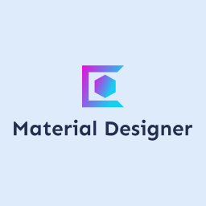

# [](https://github.com/Neopallium/material_designer)

Design custom materials for Bevy.

- Loads objects, materials from simple settings files.
- **Hot-reloading** of shaders, textures, and other material/object settings.
- Try out custom materials/shaders with different shapes/textures.

## Files for Camera/Objects/Materials

On start the camera and objects are loaded from:
- `assets/settings.camera`
- And all files in: `assets/objects/*.obj`

### assets/settings.camera:
```ron
(
  fov_degrees: 90.0,
  translation: (3.0, 5.0, -8.0),
)
```

### assets/objects/*.obj
```ron
(
  shape: Cube(2.0),
  translation: (0.0, 2.0, 0.0),
  material: (
    material_type: "materials/base_texture.material_type",
    resources: {
      "base_texture": Texture("branding/icon.png"),
      "base_color": Color(Rgba(red: 0.0, green: 1.0, blue: 0.0, alpha: 1.0)),
    }
  )
)
```

### assets/materials/*.material_type
```
(
  name: "BaseTexture",
  pipeline: (
    vertex: "shaders/base_texture.vert",
    fragment: Some("shaders/base_texture.frag"),
  ),
  resource_types: {
    "base_texture": Texture,
    "base_color": Color,
  }
)
```
